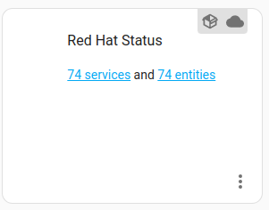
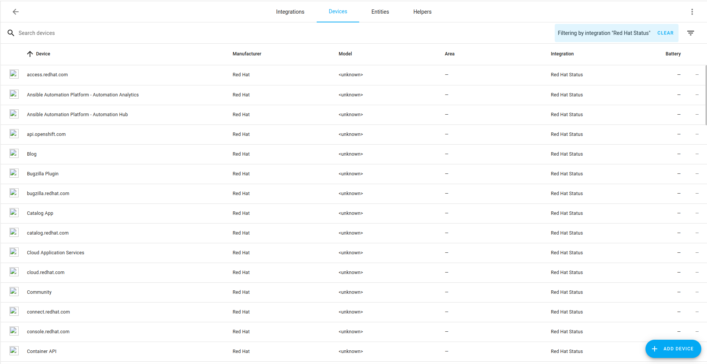
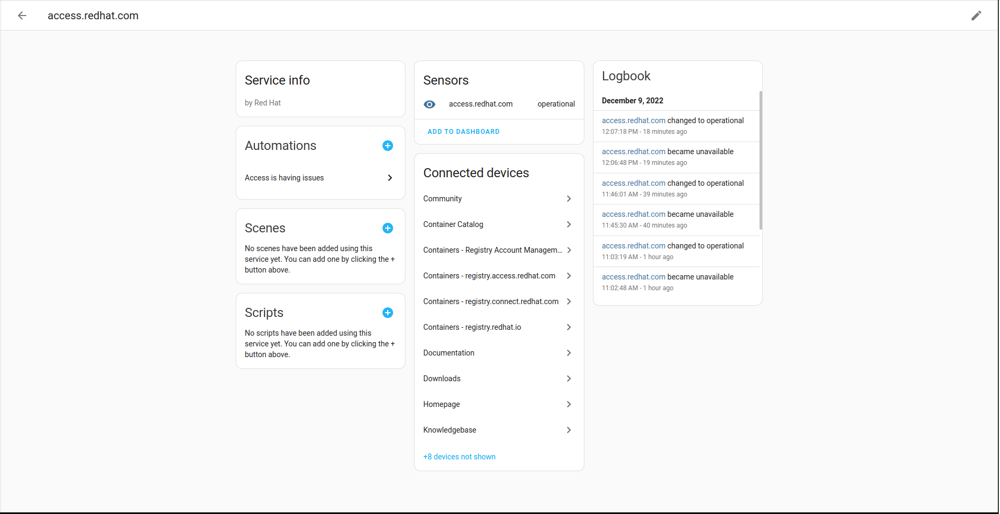

# Red Hat status integration to Home Assistant

Warning: This integration was created as part of a Hackathon, it might not be complete or fully working.

This home assistant integration reads the [summary API endpoint](https://status.redhat.com/api/v2/summary.json) and extracts the components as Services and Sensors for consumption.

Check Home assistant docs about installing custom components (or create a PR with the details/links here)

## Screenshots

### Integration summary

### List of devices

### Device access.redhat.com

